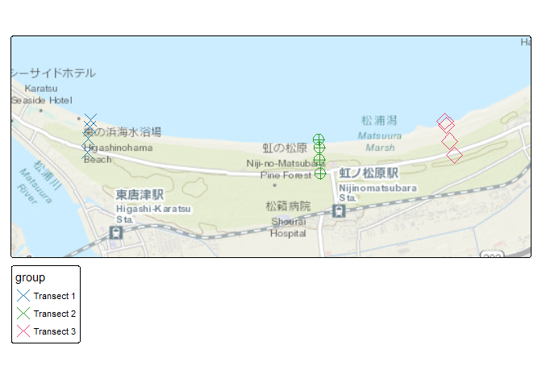
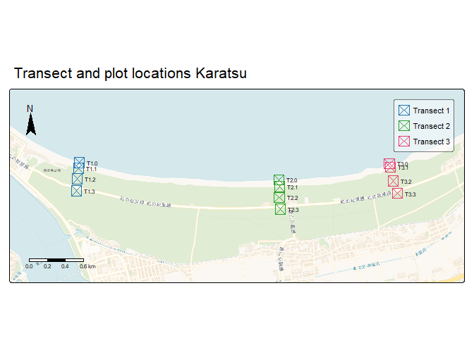

Making Transect Maps
================
Erik de Jong
2025-04-18

## Explainer

This short document will walk you through the steps necessary to plot
points recorded during fieldwork. As we’re aiming for high quality maps
that can be used in publications/print (e.g. 300-600 dpi), we’ll use the
`tmap` library and its static map functions.

### Load the required libraries

I usually use the `pacman` library to load packages, as its syntax is a
bit more simple, but more importantly it will install packages
automatically instead of having to use the conventional
`install.packages()` and `library()`. We’ll also load `tmaptools` for
some convenient bounding box tools and the `sf` package to work and
wrangle with spatial data.

``` r
pacman::p_load(tidyverse, tmap, tmaptools, sf)
```

## Load the data

In my case, the data was recorded with
[Oruxmaps](https://www.oruxmaps.com/cs/en/) as waypoints and directly
exported as a .gpx file. The beauty of this is that `sf` has a build in
wrapper that allows for the import of .gpx files. It’s however also
possible to turn you longitudinal and latitudinal coordinates into and
`sf` object with a bit of work. There are **two steps** to load your
.gpx:

Step 1 requires you to explore which layers are present in your gpx
file, common examples are waypoint and track layers. This can be done
with `st_layers()`

``` r
st_layers("gpx/Area1_20250418.gpx")
```

    ## Driver: GPX 
    ## Available layers:
    ##     layer_name     geometry_type features fields crs_name
    ## 1    waypoints             Point       12     24   WGS 84
    ## 2       routes       Line String        0     12   WGS 84
    ## 3       tracks Multi Line String        0     12   WGS 84
    ## 4 route_points             Point        0     25   WGS 84
    ## 5 track_points             Point        0     26   WGS 84

Note that the results displayed also conveniently display the geometry
type, e.g. points, or (multi) line strings. It also gives you the
projections used in this data. As projections can be different between
data, it’s good to be aware of this as they might need to be transformed
in order to match. But this is not important here now.

We only have a waypoint layer in this .gpx file, and more precisely 12
points (coordinates) in total. This matches the data collection, as we
made 3 transects with each 4 locations.

Now we will load the .gpx in the R environment as an sf object with
`st_read()`. In this function we provide the filepath of the .gpx and
the layer we want to import, *waypoints* in this case.

``` r
location.data <- st_read("gpx/Area1_20250418.gpx", layer = "waypoints")
```

    ## Reading layer `waypoints' from data source 
    ##   `C:\Users\erik6\OneDrive\Documents\JPN-coast-research\gpx\Area1_20250418.gpx' 
    ##   using driver `GPX'
    ## Simple feature collection with 12 features and 24 fields
    ## Geometry type: POINT
    ## Dimension:     XY
    ## Bounding box:  xmin: 129.9945 ymin: 33.4437 xmax: 130.0264 ymax: 33.44757
    ## Geodetic CRS:  WGS 84

## Plotting the points

Now the fun begins as we can start plotting the map. It is not strictly
necessary but it’s good to obtain the bounding box of the points we
imported, meaning 4 values that describe a square in which all our
imported points fit (bottom left and top right). We’ll use `st_bbox()`
for this.

``` r
bounding.box <- st_bbox(location.data)
bounding.box
```

    ##      xmin      ymin      xmax      ymax 
    ## 129.99452  33.44370 130.02643  33.44757

We’ll start to make a basic map with `tmap`. The `tmap` reference manual
can be found [here](https://r-tmap.github.io/tmap/index.html). A basic
tmap has a `tm_shape()` which load the data, a basemap with
`tm_basemap()` and since we have points we want to plot we’ll use
`tm_symbols()` ([but we could have used `tm_bubbles` or `tm_dots` as
well](https://r-tmap.github.io/tmap/reference/tm_symbols.html#details)).
We will use shape *4* as this is the shape that best describes where the
treasure is hidden.

``` r
tm_shape(location.data, bbox = bounding.box)+
  tm_basemap()+
  tm_symbols(shape=4, col = "red")
```

<!-- -->

The result above is our first attempt at a map! An while it works it’s
not great, for example the bounding box is too narrow causing our points
almost to drop off the map. Also the base layer might be a bit minimal.
So in the next attempt we’re going to expand the bounding box with the
`tmaptools`’ function `bb()` where the parameter *ext-4* will especially
enlarge the height. We’re also changing the basemap to
*Esri.WorldImagery* or *Esri.WorldTopoMap* and play a bit with the zoom
level of these basemaps.

``` r
bounding.box
```

    ##      xmin      ymin      xmax      ymax 
    ## 129.99452  33.44370 130.02643  33.44757

``` r
bounding.box.two <- bb(bounding.box, ext = -4)

tm_shape(location.data, bbox = bounding.box.two)+
  tm_basemap("Esri.WorldTopoMap", zoom=14)+
  tm_symbols(shape=4, col = "red")
```

<!-- -->

``` r
tm_shape(location.data, bbox = bounding.box.two)+
  tm_basemap("Esri.WorldImagery", zoom=15)+
  tm_symbols(shape=4, col = "red")
```

<!-- -->

## Changing the colors

As we made 3 transects in the field, we want the map to reflect this.
Therefore, we have to trandform the data a bit first with `dyplr`
functions. First we inspect the data we have used so far with
`slice_head(n=5)` to inspect the first 5 rows.

``` r
location.data %>%  slice_head(n=5)
```

    ## Simple feature collection with 5 features and 23 fields
    ## Geometry type: POINT
    ## Dimension:     XY
    ## Bounding box:  xmin: 130.0146 ymin: 33.44502 xmax: 130.0264 ymax: 33.44749
    ## Geodetic CRS:  WGS 84
    ##      ele                time magvar geoidheight name  cmt
    ## 1  13.60 2025-04-17 12:29:38     NA          NA T3.0 <NA>
    ## 2   2.15 2025-04-17 12:54:58     NA          NA T3.1 <NA>
    ## 3 -10.27 2025-04-17 13:28:38     NA          NA T3.2 <NA>
    ## 4  23.69 2025-04-17 13:45:55     NA          NA T3.3 <NA>
    ## 5   0.14 2025-04-17 14:42:07     NA          NA T2.0 <NA>
    ##                     desc  src link1_href link1_text link1_type link2_href
    ## 1       coast transact 3 <NA>       <NA>       <NA>       <NA>       <NA>
    ## 2 Transect 3 quadrant 1  <NA>       <NA>       <NA>       <NA>       <NA>
    ## 3   transect 3 section 2 <NA>       <NA>       <NA>       <NA>       <NA>
    ## 4   transect 3 section 3 <NA>       <NA>       <NA>       <NA>       <NA>
    ## 5                  shore <NA>       <NA>       <NA>       <NA>       <NA>
    ##   link2_text link2_type      sym     type  fix sat hdop vdop pdop ageofdgpsdata
    ## 1       <NA>       <NA> Waypoint Waypoint <NA>  NA   NA   NA   NA            NA
    ## 2       <NA>       <NA> Waypoint Waypoint <NA>  NA   NA   NA   NA            NA
    ## 3       <NA>       <NA> Waypoint Waypoint <NA>  NA   NA   NA   NA            NA
    ## 4       <NA>       <NA> Waypoint Waypoint <NA>  NA   NA   NA   NA            NA
    ## 5       <NA>       <NA> Waypoint Waypoint <NA>  NA   NA   NA   NA            NA
    ##   dgpsid                  geometry
    ## 1     NA POINT (130.0256 33.44749)
    ## 2     NA POINT (130.0257 33.44719)
    ## 3     NA  POINT (130.026 33.44605)
    ## 4     NA POINT (130.0264 33.44502)
    ## 5     NA POINT (130.0146 33.44613)

Upon inspection we can notice that the name field contains our transects
numbering. This numbering uses the format T(transect number).(plot
number). Now we want to add a grouping variable to the dataset. We do
this with `mutate` and `case_when`. We also want to make the new
variable into a factor instead of a text variable.

``` r
location.data <- location.data %>% 
  mutate(
    group = factor( #changes the new variable in a factor variable
      case_when(
        grepl("^T1.", name) ~ "Transect 1",
        grepl("^T2.", name) ~ "Transect 2",
        grepl("^T3.", name) ~ "Transect 3",
        TRUE ~ NA_character_
      )
    )
  )

str(location.data)
```

    ## Classes 'sf' and 'data.frame':   12 obs. of  25 variables:
    ##  $ ele          : num  13.6 2.15 -10.27 23.69 0.14 ...
    ##  $ time         : POSIXct, format: "2025-04-17 12:29:38" "2025-04-17 12:54:58" ...
    ##  $ magvar       : num  NA NA NA NA NA NA NA NA NA NA ...
    ##  $ geoidheight  : num  NA NA NA NA NA NA NA NA NA NA ...
    ##  $ name         : chr  "T3.0" "T3.1" "T3.2" "T3.3" ...
    ##  $ cmt          : chr  NA NA NA NA ...
    ##  $ desc         : chr  "coast transact 3" "Transect 3 quadrant 1 " "transect 3 section 2" "transect 3 section 3" ...
    ##  $ src          : chr  NA NA NA NA ...
    ##  $ link1_href   : chr  NA NA NA NA ...
    ##  $ link1_text   : chr  NA NA NA NA ...
    ##  $ link1_type   : chr  NA NA NA NA ...
    ##  $ link2_href   : chr  NA NA NA NA ...
    ##  $ link2_text   : chr  NA NA NA NA ...
    ##  $ link2_type   : chr  NA NA NA NA ...
    ##  $ sym          : chr  "Waypoint" "Waypoint" "Waypoint" "Waypoint" ...
    ##  $ type         : chr  "Waypoint" "Waypoint" "Waypoint" "Waypoint" ...
    ##  $ fix          : chr  NA NA NA NA ...
    ##  $ sat          : int  NA NA NA NA NA NA NA NA NA NA ...
    ##  $ hdop         : num  NA NA NA NA NA NA NA NA NA NA ...
    ##  $ vdop         : num  NA NA NA NA NA NA NA NA NA NA ...
    ##  $ pdop         : num  NA NA NA NA NA NA NA NA NA NA ...
    ##  $ ageofdgpsdata: num  NA NA NA NA NA NA NA NA NA NA ...
    ##  $ dgpsid       : int  NA NA NA NA NA NA NA NA NA NA ...
    ##  $ geometry     :sfc_POINT of length 12; first list element:  'XY' num  130 33.4
    ##  $ group        : Factor w/ 3 levels "Transect 1","Transect 2",..: 3 3 3 3 2 2 2 2 1 1 ...
    ##  - attr(*, "sf_column")= chr "geometry"
    ##  - attr(*, "agr")= Factor w/ 3 levels "constant","aggregate",..: NA NA NA NA NA NA NA NA NA NA ...
    ##   ..- attr(*, "names")= chr [1:24] "ele" "time" "magvar" "geoidheight" ...

Now we have made the grouping variable and therefore we can adjust the
map. For example we can use different colors and add a legend
(automatically), change the shape depending on the group or do both.

``` r
tm_shape(location.data, bbox = bounding.box.two)+
  tm_basemap("Esri.WorldTopoMap", zoom=14)+
  tm_symbols(shape=4, col = "group")
```

<!-- -->

``` r
tm_shape(location.data, bbox = bounding.box.two)+
  tm_basemap("Esri.WorldTopoMap", zoom=14)+
  tm_symbols(shape="group", col = "red")
```

<!-- -->

``` r
tm_shape(location.data, bbox = bounding.box.two)+
  tm_basemap("Esri.WorldTopoMap", zoom=14)+
  tm_symbols(shape="group", 
             fill_alpha = 0,
             col="group",
             shape.scale = tm_scale_categorical(values=c(4, 10,5)),
             shape.legend = tm_legend_combine("group")
             )
```

<!-- -->

We might also want to add a north arrow, scale bar, title and legend
title:

``` r
finalmap <- tm_shape(location.data, bbox = bounding.box.two)+
  tm_basemap("CartoDB.Voyager", zoom=15)+
  tm_symbols(shape=7, 
             fill_alpha = 0,
             col="group",
             col.legend = tm_legend(title = "Transect"),
             shape.scale = tm_scale_categorical(values=c(4, 10,5))
             )+
  tm_compass(type = "arrow",position = c("left","top"), bg.alpha = 0)+
  tm_text("name",size = .5, xmod=2)+
  tm_scalebar(position = c("left", "bottom"),, bg.alpha = 0)+
  tm_title("Transect and plot locations Karatsu")+
  tm_options(legend.position = c("right","top"),legend.bg.alpha = .5
            )
finalmap
```

<!-- -->

And export the map with `tmap_save`

``` r
  tmap_save(finalmap, filename = "Images/Karatsu_map.png", width = 15, height = 10,units = "cm", dpi = 600, scale=.7)
```

    ## Map saved to C:\Users\erik6\OneDrive\Documents\JPN-coast-research\Images\Karatsu_map.png

    ## Resolution: 3543.307 by 2362.205 pixels

    ## Size: 5.905512 by 3.937008 inches (600 dpi)

The final code will result in the following saved map:

## 
